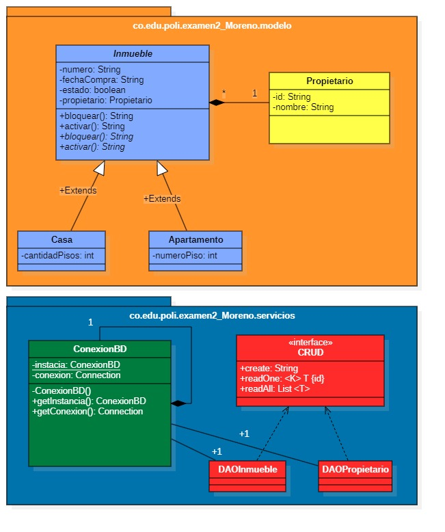

# 🏠 Sistema de Gestión de Inmuebles

Aplicación desarrollada en JavaFX que permite la gestión de inmuebles (casas y apartamentos), incluyendo su registro y consulta, con persistencia en base de datos MySQL.

---

## 📌 Características

- Registro de inmuebles
- Consulta por número
- Asociación con propietarios
- Soporte para tipos: Casa y Apartamento
- Interfaz gráfica con JavaFX
- Persistencia en base de datos (MySQL)
- Arquitectura por capas (Modelo, DAO, Controlador, Vista)
- Pruebas unitarias y de integración

---

## 🧱 Estructura del Proyecto

- **modelo**: Clases principales (Inmueble, Casa, Apartamento, Propietario)
- **servicios**: DAO y conexión a base de datos
- **controlador**: Lógica de la aplicación
- **vista**: Interfaz gráfica en JavaFX

---

## 🗄️ Base de Datos

Nombre de la base de datos:
examen2_moreno
Incluye script SQL para la creación de tablas.

---

## 🖼️ Diagrama UML

---

## 🚀 Tecnologías utilizadas

- Java
- JavaFX
- MySQL
- JDBC
- JUnit

---

## ▶️ Ejecución

1. Configurar la base de datos en MySQL
2. Ejecutar el script SQL
3. Ejecutar la clase principal (`App.java`)
4. Usar la interfaz para crear y consultar inmuebles

---

## 👨‍💻 Autor

Johan Moreno
